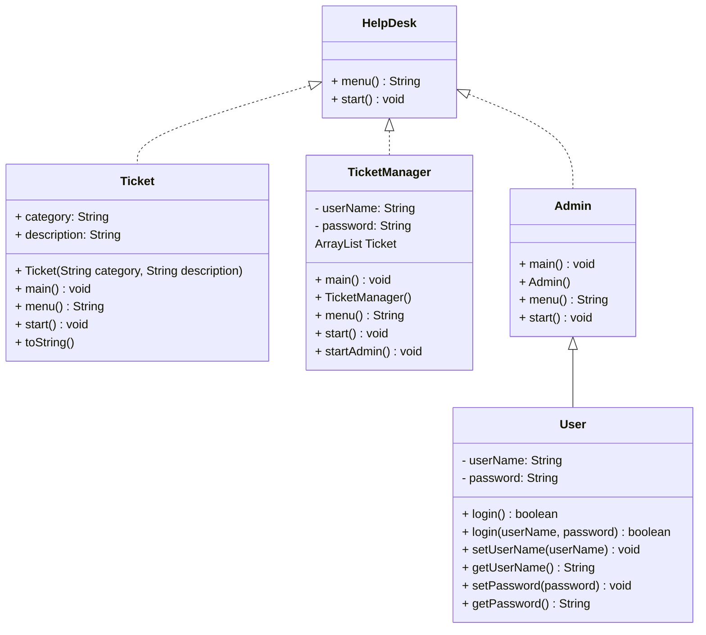

# CS121-Final-Project
IT Help Desk Ticket Program

The goal of this program is for a user to be able to create a help desk ticket for any technical support. The user will be prompted to type a number based on the category, and then input a description based on the issue they are encountering. An admin will be able to use their credentials to log in and view and reslove any open tickets.

