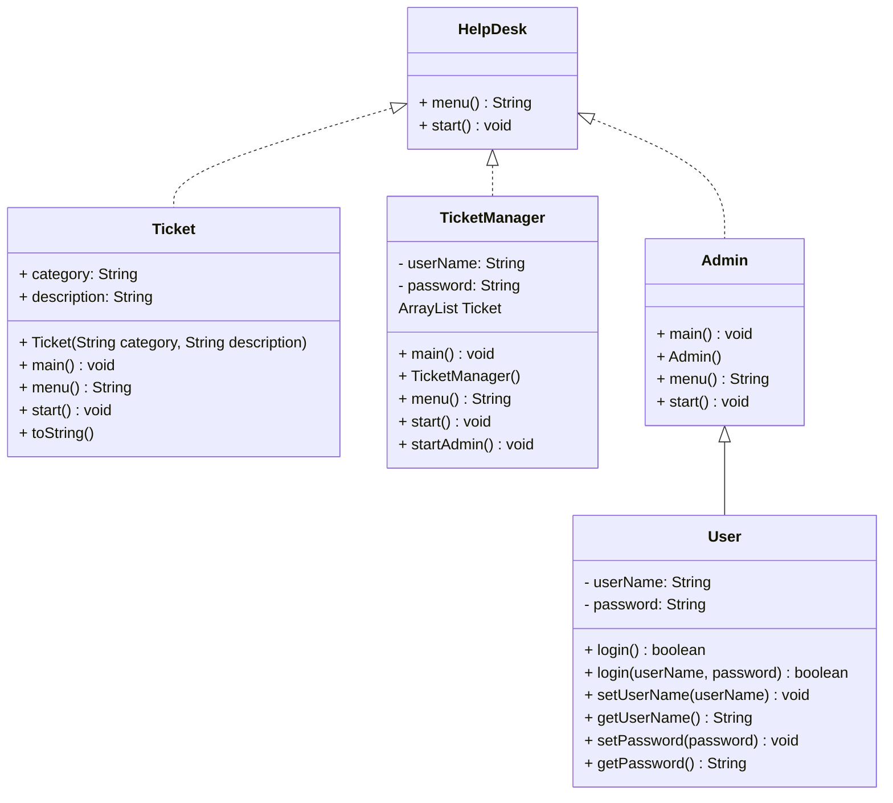

# CS121-Final-Project
IT Help Desk Ticket Program

```mermaid
classDiagram

class Ticket{
    + Ticket(String category, String description)
    + main() void
    + menu() String
    + start() void
    + category: String
    + description: String
    + toString()
}

class HelpDesk{
    + menu() String
    + start() void
}

class User{
    - userName: String
    - password: String
    + login() boolean
    + login (userName, password) boolean
    + setUserName(userName) void
    + getUserName() String
    + setPassword(password) void
    + getPassword() String
}

class TicketManager{
    - userName: String
    - password: String
    + main() void
    + TicketManager()
    + menu() String
    + start() void
    + startAdmin() void
    ArrayList Ticket
}

class Admin{
    + main() void
    + Admin()
    + menu() String
    + start() void
}
HelpDesk <|.. Admin
HelpDesk <|.. Ticket
HelpDesk <|.. TicketManager
Admin <|-- User
```
